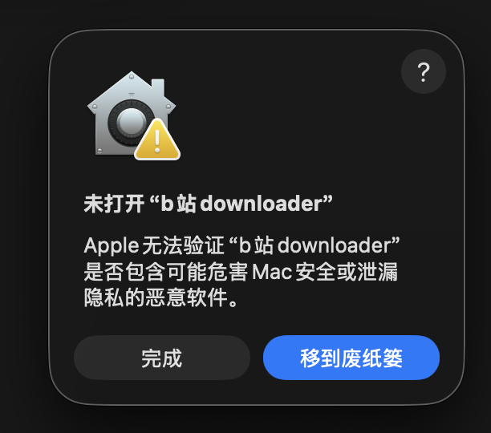
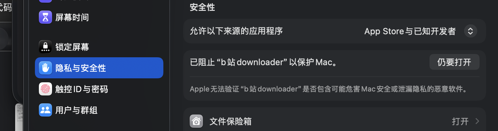
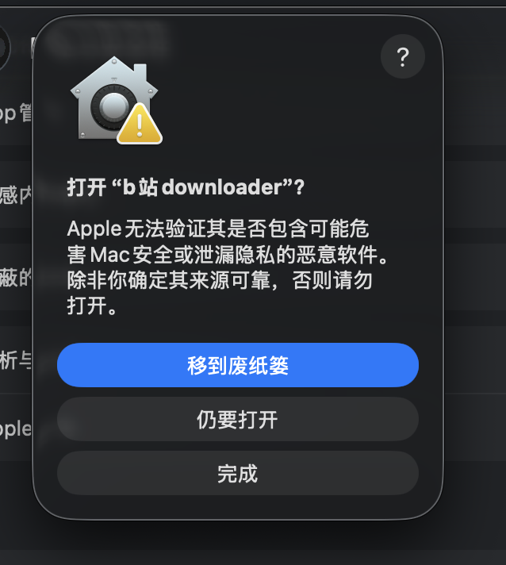

# b站downloader

面向 m芯片 的 Bilibili 下载器。
双击后会打开命令行进行中文交互（别问我为什么不用图形界面简直脱裤子放屁放的还比穿了更臭`其实就是信息太乱了 本身是个不用动脑子一步一步走的活 非得让小白费脑子看那个花里胡哨各种设置的界面qaq`）。发布包内置运行环境 点击就能用

## 第一部分：大白话安装

Mac 芯片是 Apple M 系列（arm64），并且系统是 macOS 14 以上，就能安装。

1. 到[下载页][release]下载 arm64 ZIP 和同名 `.sha256`。
2. 双击 ZIP，得到 `b站downloader.app`；放桌面或拖进“应用程序”都行。
3. 首次双击如果提示“Apple 无法验证……”，按下面做（确认 App 是从本仓库 Release 下载的再继续）：

   **① 先点“完成”，不要点“移到废纸篓”。**

   

   **② 打开“系统设置 → 隐私与安全性”，往下翻，找到“已阻止‘b站 downloader’以保护 Mac”，点右边的“仍要打开”。**

   

   **③ 再次弹出确认框时，点“仍要打开”。这一步通常只需操作一次。**

   
4. App 会打开命令行（**就是那个黑色框框**）。按中文菜单选登录方式，粘贴 BV/AV、链接或整段分享
   文字，再选分p、画质、音频和无音频视频（想下什么下什么咯下载过程中会让你选择）。
6. 下载过程中让你输密码你就输入mac开机密码
7. 下载结束会自动打开 `~/Downloads/b站downloader/`。
8. **下载功能可以支持音频格式选择 视频画质选择 单独下载或导出视频和音频**

ps：登录不能绕过会员限制。
*绝对没后门没病毒_有的话我出门被车撞死*
*看到这就行了 剩下的是给我自己看的*


---

## 第二部分：详细专业 README

### 1. 项目定位

`b站downloader` 是面向 macOS 的 Terminal 交互前端，负责整理输入、生成安全
且可复现的下载计划，并调用包内的 yt-dlp 与 FFmpeg。`Info.plist` 将它配置为
后台辅助型 App，因此没有传统 Dock 主界面。它不是 Bilibili 官方客户端，
不提供 DRM、会员、地区、付费或版权权限绕过，也不通过抓包寻找隐藏音轨。

核心设计目标：

- 新的 Apple Silicon Mac 解压后即可运行，无 Homebrew 依赖。
- 不要求用户复制 Cookie、SESSDATA 或密码。
- 下载前明确显示登录来源、分P、画质和全部输出文件计划。
- 严格区分有损 MP3 与平台实际返回的 FLAC，拒绝“假无损”。
- App bundle 保持只读，下载和缓存都写入用户目录。
- 构建、依赖版本、许可证和发布验证可审计。

### 2. 支持范围与当前版本

| 项目 | 当前要求或版本 |
|---|---|
| 处理器 | Apple Silicon arm64；不支持 Intel Mac，后续芯片以实际兼容性为准 |
| 最低系统 | macOS 14 Sonoma |
| App | b站downloader 1.1.0 |
| Python 运行时 | 3.9.6 arm64 |
| yt-dlp | 2026.07.04 官方 macOS standalone binary |
| FFmpeg | 7.1 arm64，由 imageio-ffmpeg 0.6.0 提供 |
| 发布状态 | v1.1.0 输出模式与安装指引更新；v1.0.1 为番剧兼容性修复；v1.0.0 为首个公开发布版；ad-hoc 签名，尚未 Apple 公证 |

当前 ZIP：

```text
bilibili-downloader-1.1.0-macos-arm64.zip
```

下载页同时提供同名 `.sha256` 文件，GitHub 也会显示 Release asset digest。
每次重新打包都可能产生新的哈希，应以同一次 Release 附带的校验值为准。

两个文件都放在“下载”目录时，可在 Terminal 校验：

```bash
cd ~/Downloads
shasum -a 256 -c bilibili-downloader-1.1.0-macos-arm64.zip.sha256
```

### 3. 运行架构

| 组件 | 职责 |
|---|---|
| Finder 启动器 | 定位包内 `run.command`，再通过 Terminal 启动交互界面 |
| Python 前端 | 校验 URL、读取公开元数据、生成下载计划和管理缓存 |
| yt-dlp | 读取媒体格式、可选浏览器登录态并下载媒体流 |
| FFmpeg | 合并音视频、生成 MP3/FLAC，并验证媒体可解码 |
| 用户目录 | 保存最终文件、`.part` 续传文件和受控音频缓存 |

冻结后的 App 只接受 bundle 内的 FFmpeg，不会因为另一台 Mac 安装了不同版本
的 Homebrew FFmpeg 而改变行为。源码模式才允许使用环境变量、PATH 或常见
Homebrew 路径作为开发回退。

### 4. 完整功能

- 接受纯数字 AV 号、`av...`、`BV...`、官方视频/番剧链接和 `b23.tv` 短链。
- 可从“标题 + URL”的整段分享文字中提取第一个 HTTP(S) 链接。
- 拒绝非 Bilibili 域名、嵌入用户名/密码的 URL 和疑似命令行参数。
- 可选择匿名、Google Chrome 或 Safari 登录状态。
- 多P/分集支持当前项、全部、`1,3-5` 自定义范围、完整列表和返回链接输入。
- 画质支持最高可用、最高 4K、1080P、720P、480P，并可列出实际格式。
- 完整视频、无画面音频和无声音视频可独立选择并自由组合，至少选择一种。
- 独立音频可选 MP3 V0 或严格 FLAC；纯音频计划不再要求选择视频画质。
- 下载前显示完整摘要，可开始、重新选择或取消。
- 下载及 FFmpeg 阶段均支持暂停、恢复和确认退出。
- 成功后自动打开输出目录。

当前界面不提供字幕、弹幕、封面、评论或 info-json 下载选项。

### 5. 登录状态与隐私

选择 Chrome 或 Safari 后，包内 yt-dlp 使用 `--cookies-from-browser` 在当前
进程中读取浏览器登录状态。

程序不会：

- 生成或保存 `cookies.txt`；
- 要求输入 Bilibili 密码、Cookie 或 SESSDATA；
- 把浏览器 Cookie 写入项目、下载目录或日志；
- 启用用户自定义 yt-dlp 配置、插件或远程组件；
- 把登录状态用于账号原本无权访问的格式。

Chrome 首次使用可能弹出 `Chrome Safe Storage` 钥匙串授权，这是 Chrome
Cookie 解密所需的 macOS 系统提示，不是让用户再次输入 Bilibili 密码。

当前浏览器探测只识别 `/Applications/Google Chrome.app` 和
`/Applications/Safari.app`。Chrome 使用 yt-dlp 自动识别的默认 Profile，
界面暂不支持选择其他 Profile，也不支持 Firefox、Edge 或 Arc。安装在用户
`~/Applications` 目录中的 Chrome 也不会自动出现在菜单中。

Safari 如果报告 `Operation not permitted`，可能需要给 Terminal“完全磁盘
访问”：

```text
系统设置 → 隐私与安全性 → 完全磁盘访问 → Terminal
```

授权后应完全退出 Terminal，再重新打开 App。使用结束后可以撤销该权限。

### 6. URL 与分P处理

普通 BV/AV 链接优先通过公开页面元数据取得视频标题和分P名称；短链或特殊页面
会由 yt-dlp 解析规范链接，再用 flat-playlist 探测。所有探测都失败时，程序
降级为“当前单P”，不会凭空猜测分P编号。

番剧 `ep`/`ss` 播放页会先读取对应季度的公开分集目录。只选当前集时保留
`ep` 链接；全选或自选多集时切换到对应 `ss` 播放列表，确保编号与实际分集
顺序一致。若接口信息不完整，程序会安全降级，不会把未知分集误当作第 1 集。

当前只支持单个视频、番剧播放页及其分P/分集；不支持用户空间、收藏夹、
medialist、直播或任意站内播放列表。

多P/分集菜单：

| 输入 | 行为 |
|---|---|
| 直接回车 | 只下载当前 P/集 |
| `A` | 下载全部 |
| `1,3-5` | 下载第 1、3、4、5 个 P/分集 |
| `L` | 显示完整列表 |
| `N` | 全不选，不启动当前链接，并返回链接输入 |

自定义范围会去重、排序并检查上下界，同一选择会同时应用于完整视频、无画面音频
和无声音视频。

### 7. 画质策略

| 菜单 | yt-dlp 选择策略 |
|---|---|
| 最高可用 | 优先最佳视频流 + 最佳音频流，必要时回退单文件 |
| 最高 4K | 将高度限制为 2160 |
| 最高 1080P | 将高度限制为 1080 |
| 最高 720P | 将高度限制为 720 |
| 最高 480P | 将高度限制为 480 |
| 查看格式 | 列出当前登录状态实际能取得的格式 |

菜单表达的是“上限”，最终格式仍由视频源、账号权限和平台响应决定。会员、4K、
HDR、杜比等不会因为选择菜单就自动获得。若只选择无画面音频，程序会跳过画质
菜单；只要选择了完整视频或无声音视频，就仍需选择画质。

完整视频默认请求独立视频流与音频流并由 FFmpeg 合并，优先输出 MP4；源编码
组合不兼容 MP4 时允许输出 MKV。

### 8. 输出文件选择

三类输出相互独立，可只选一种或自由组合；如果全部不选，程序会提示重新选择，
不会创建下载目录或启动下载。

| 输出 | 是否可关闭 | 源选择与处理 |
|---|---|---|
| 完整视频（有画面、有声音） | 可以；默认开启 | 按所选画质取得视频与音频并自动合并，优先输出 MP4 |
| 无画面音频（只有声音） | 可以；默认关闭 | 可选 MP3 V0 或严格 FLAC；纯音频计划不询问视频画质 |
| 无声音视频（只有画面） | 可以；默认关闭 | 按所选画质下载最佳纯视频流，不包含音轨 |

无画面音频的处理方式：

| 格式 | 源选择与处理 |
|---|---|
| MP3 V0 | 优先最佳 FLAC 音轨，否则最佳可用音轨；使用 libmp3lame `-q:a 0` 转换并输出双声道 |
| 严格 FLAC | 只接受平台返回且音频编码标识以 `flac` 开头的源 |

严格 FLAC 的边界：

- 没有 AAC、Dolby 或其他有损音轨回退。
- 不会只改扩展名，也不会把有损源转成 FLAC 后声称“无损”。
- 平台 FLAC 会以 FFmpeg FLAC 压缩等级 8 重新封装/编码，因此不是响应文件的
  逐字节副本。
- 文件是无损 FLAC 不等于一定达到 Hi-Res 采样率或位深；以实际源参数为准。
- 若某些分P没有返回 FLAC，该分P的 FLAC 输出会报告失败；其他已经完成的所选
  输出仍会保留，程序最终退出码为 `1`。

MP3 的 `-ac 2` 会把多声道源下混为立体声。独立音频会单独下载并处理源音轨，
不是简单从完整视频中无损拆出。同时选择多类输出会增加网络流量、磁盘占用
和处理时间。

### 9. 暂停、继续与退出

yt-dlp 和 FFmpeg 都在独立 POSIX 进程组中运行。暂停只适用于当前正在执行的
下载、合并或转码子任务；菜单输入、元数据探测和格式列表阶段不使用这套暂停
机制。任务运行时按 `Control+C`：

1. 前端向整个任务进程组发送 `SIGSTOP`。
2. 用户保持提示不操作时，任务持续暂停。
3. 直接回车会发送 `SIGCONT` 并恢复。
4. 输入 `Y` 退出时，先恢复暂停进程，再依次尝试 `SIGINT`、`SIGTERM`，
   最后才使用 `SIGKILL`。

这样可同时暂停 yt-dlp、分片下载器和 FFmpeg 子进程，并给正常清理逻辑留出
时间。

网络下载留下的 `.part` 文件只保证在 URL、分P、格式参数和输出路径都相同
时可续传。FFmpeg 转换不能从中间百分比续转；取消时会删除不完整目标，但可能
保留已下载音频源供下次重新转换。成功后程序会尝试清理缓存，失败或中断时则
可能保留文件用于重试和排错。

不要直接关闭 Terminal 窗口；应优先按 `Control+C`，再输入 `Y`。如果窗口被
强制关闭，先在“活动监视器”确认没有残留的 yt-dlp/FFmpeg 进程，再清理缓存。

### 10. 文件位置与命名

最终输出：

```text
~/Downloads/b站downloader/
```

可恢复音频缓存：

```text
~/Library/Caches/b站downloader/
```

缓存键由规范 URL、分P集合和音频模式共同计算，避免不同任务互相复用或误删。
程序只会处理位于自身缓存根目录内、且由成功 `after_move` 记录写入清单的音频
源文件。成功转换后会清理对应源与空缓存目录。

常见文件名：

```text
视频标题 [BV号].mp4
视频标题 [BV号].mkv
视频标题 [BV号].audio-MP3-V0-source-aac.mp3
视频标题 [BV号].audio-FLAC-original.flac
视频标题 [BV号].video-only-f格式号.mp4
```

### 11. 安全模型

- URL 只允许官方 Bilibili 视频/番剧路径与 b23.tv。
- URL 作为 `--` 后的独立参数传给 yt-dlp，避免被解析成命令选项。
- yt-dlp 使用 `--ignore-config`、`--no-plugin-dirs`、
  `--no-remote-components` 和 `--no-cache-dir`。
- 冻结 App 只执行签名 bundle 中的 yt-dlp 与 FFmpeg。
- App 不写自己的 bundle，适合安装在只读位置。
- 下载前不创建输出目录；用户取消计划不会留下空目录。
- 音频转换先写入受控临时文件，成功后原子替换最终文件。
- 发布测试会扫描开发机绝对路径和 Homebrew/用户目录动态库依赖。

`.sha256` 可以发现下载损坏或附件被替换，但 ZIP 与哈希若来自同一个被控制的
渠道，并不能单独证明发布者身份。应从可信的仓库/Release 页面取得文件，并
结合 HTTPS、GitHub asset digest 和项目公告核对。

不要在 Issue、日志或聊天中提供 Cookie、SESSDATA、密码、钥匙串内容、完整
环境变量或未脱敏的个人目录路径。

### 12. 常见问题

| 现象 | 处理 |
|---|---|
| 只能看到低清晰度 | 选择已经登录 Bilibili 的浏览器，再用“查看格式”确认账号实际权限 |
| Chrome 登录未识别 | 在 Chrome 打开 bilibili.com 确认登录，并允许 Safe Storage 钥匙串访问 |
| Safari 报权限错误 | 给 Terminal 完全磁盘访问，完全退出后重新打开 |
| FLAC 被跳过 | 视频或账号没有返回原生 FLAC；这是严格模式的预期结果 |
| 合并或转换失败 | 重新下载完整 ZIP，不要替换 App 内 FFmpeg |
| 下载中断 | 使用相同链接、分P和画质重试，yt-dlp 会利用 `.part` 续传 |
| 磁盘不足 | 清理下载目录；确认没有任务运行后再检查用户缓存 |
| Terminal 窗口卡在暂停提示 | 直接回车继续，或输入 `Y` 安全退出；不要直接关窗口 |
| macOS 阻止首次打开 | 确认文件来自本仓库 Release，然后按第一部分第 3 步操作；不要全局移除隔离属性 |

报告问题时建议提供 macOS 版本、芯片型号、视频 URL、所选登录来源和最后
30 行日志，并先删除个人路径与账号信息。

### 13. 源码结构

```text
.
├── assets/
│   ├── Info.plist
│   ├── icon-1024-clean.png
│   ├── launcher.c
│   └── run.command
├── docs/
│   └── images/                  # Gatekeeper 安装步骤截图
├── licenses/
├── scripts/
│   ├── build_icon.py
│   ├── build_macos_arm64.sh
│   └── test_release.sh
├── src/
│   ├── bilibili_api.py
│   ├── bilibili_ytdlp_macos.py
│   ├── download_controls.py
│   ├── download_options.py
│   └── runtime_compat.py
├── tests/
├── vendor/
│   ├── yt-dlp
│   └── yt-dlp.sha256
├── requirements-build.txt
├── THIRD-PARTY-NOTICES.md
└── README.md
```

### 14. 本地开发、构建与验证

构建要求：

- macOS 14 或更高版本的 Apple Silicon Mac；
- Xcode Command Line Tools（提供 `xcrun clang`）；
- 能创建 venv 的 `/usr/bin/python3`，或通过 `BOOTSTRAP_PYTHON` 指定的 Python；
- 首次构建可访问 PyPI，或已经准备好对应依赖缓存；
- 至少预留约 500 MB 的构建和打包空间。

仅准备测试环境：

```bash
/usr/bin/python3 -m venv .venv-build
.venv-build/bin/python -m pip install -r requirements-build.txt
```

运行单元测试：

```bash
PYTHONPATH=src .venv-build/bin/python -m unittest discover -s tests -v
```

构建：

```bash
./scripts/build_macos_arm64.sh
```

验证：

```bash
./scripts/test_release.sh
```

构建输出：

```text
dist/b站downloader.app
dist/bilibili-downloader-1.1.0-macos-arm64.zip
dist/bilibili-downloader-1.1.0-macos-arm64.zip.sha256
```

构建脚本会：

1. 创建隔离的 `.venv-build`。
2. 安装 `requirements-build.txt` 中锁定的版本。
3. 校验 vendor yt-dlp 的 SHA-256。
4. 从 imageio-ffmpeg 取得自包含 arm64 FFmpeg，并确认 MP3/FLAC 编码器存在。
5. 生成 ICNS、PyInstaller onedir 运行时和原生 arm64 Finder 启动器。
6. 复制 README、安装截图、许可证和第三方声明。
7. 完成签名、ZIP 打包及 SHA-256 文件生成。

常用构建变量：

| 变量 | 用途 |
|---|---|
| `VERSION` | App/ZIP 版本，默认 `1.1.0` |
| `BUILD_NUMBER` | `CFBundleVersion`，默认 `11000` |
| `BOOTSTRAP_PYTHON` | 构建虚拟环境所用 Python |
| `CODESIGN_IDENTITY` | 外层 bundle 签名身份；默认 `-`（ad-hoc） |

正式 Release 应固定 Python 版本。若更换 `BOOTSTRAP_PYTHON`，必须重新核对
最低系统版本、运行时依赖、`THIRD-PARTY-NOTICES.md` 和许可证清单，再执行
全部测试。仅设置 `CODESIGN_IDENTITY` 不会自动启用 Hardened Runtime、时间戳、
公证或票据附加，因此不能单独构成公开发行签名流程。

运行时开发变量：

| 变量 | 用途 |
|---|---|
| `BILIBILI_DOWNLOADER_OUTPUT_DIR` | 覆盖最终输出目录 |
| `BILIBILI_DOWNLOADER_CACHE_DIR` | 覆盖缓存目录 |
| `BILIBILI_DOWNLOADER_FFMPEG` | 仅源码模式指定 FFmpeg；冻结 App 会忽略 |

### 15. 测试覆盖

当前自动化测试共 51 项，覆盖：

- AV/BV/官方 URL、短链和带标题分享文字；
- 非官方域名、凭据 URL 和命令参数拒绝；
- 匿名与浏览器登录态命令；
- 当前/全部/自定义/全不选分P；
- 完整视频、无画面音频、无声音视频的独立选择、自由组合与空计划阻止；
- 纯音频跳过画质、画质上限与无声音视频格式；
- MP3 源优先级和严格 FLAC 无回退；
- 音频缓存路径、清单、原子转换与越界保护；
- 暂停、恢复、退出以及顽固子进程升级终止；
- 冻结 App 只使用 bundle 内 FFmpeg。

发布验证还会检查：

- `Info.plist`、arm64 架构和代码签名完整性；
- ZIP SHA-256、解压后的签名和相对启动路径；
- 安装截图同时存在于 App 与 ZIP，且 ZIP 不包含 `__MACOSX` Finder 元数据；
- App 在只读状态、空 HOME、最小 PATH 下自检；
- 无开发机路径或外部 Homebrew 动态依赖；
- 图标透明边缘；
- yt-dlp/FFmpeg 版本；
- 实际 MP3/FLAC 编码、MP4 合并和解码。

自动化测试不会读取真实浏览器 Cookie，也不会下载用户媒体。它也不覆盖：

- Finder 真实双击、互联网 quarantine 属性和 Gatekeeper 弹窗；
- Developer ID、`spctl` 信任、公证与票据验证；
- 真实 Bilibili 网络下载、会员画质、FLAC 可用性和地区/版权响应；
- Chrome/Safari 的真实 Cookie、TCC、钥匙串和非默认 Profile；
- 全新实体 Mac 及所有后续 Apple Silicon 型号。

以上项目应在发布前做人工验收。`test_release.sh` 建议在普通 Terminal 运行；
某些受限容器会禁止 PyInstaller 运行时所需的系统信号量，这属于容器权限限制。

### 16. 签名、Gatekeeper 与公证

当前 Release 使用 ad-hoc 签名，可验证文件在打包后未被修改，但不能建立 Apple
开发者身份信任。互联网下载后，Gatekeeper 可能要求用户手动“仍要打开”。
[Apple 的未知开发者 App 说明][apple-open]给出了官方操作方法。

要实现新 Mac 下载后首次双击无未知开发者提示，发布者必须：

1. 持有 Apple Developer Program 的 `Developer ID Application` 证书；
2. 以 Hardened Runtime 和安全时间戳重新签名所有 Mach-O 与外层 App；
3. 使用 `notarytool` 提交 Apple 公证；
4. 使用 `stapler` 附加公证票据；
5. 重新生成 ZIP 并发布新的 SHA-256。

GitHub 托管、ad-hoc 签名或自签名证书都不能替代 Apple 公证。参考
[Apple Developer ID][developer-id]、[Apple 公证文档][notarization]和
[PyInstaller macOS 签名说明][pyinstaller-signing]。

### 17. 第三方组件与许可证

项目本身使用 Apache-2.0。发布包还聚合了 yt-dlp、FFmpeg、Python、
PyInstaller、Requests 及其依赖；许可证文本位于 `licenses/`，具体版本、
来源、二进制校验值和 FFmpeg GPL 构建信息见
[`THIRD-PARTY-NOTICES.md`](THIRD-PARTY-NOTICES.md)。

FFmpeg 二进制报告启用了 GPL 组件，包括 libmp3lame、libx264 和 libx265。
再分发者应自行确认并满足许可证、对应源码、构建信息和 notices 等全部义务；
仅提供链接不自动代表合规。详情参考 [FFmpeg Legal][ffmpeg-legal]。

### 18. 上游来源与本仓库改动

项目最初来源于 [Henryhaohao/Bilibili_video_download][upstream]。本仓库增加并
维护 Apple Silicon Terminal 前端、浏览器登录态、分P/画质选择、严格音频
语义、进程组暂停、macOS App 打包、测试和发布文档。上游旧版用法不应与当前
macOS Release 混用。

### 19. 使用边界

请只下载自己创作、获得授权、允许离线保存或法律明确允许的内容，并遵守平台
条款、版权规则与当地法律。项目不对未经授权的下载、传播或商业使用负责。

[release]: https://github.com/srrrr22rr/bilibili_downloader_for_mac/releases/tag/v1.1.0
[apple-open]: https://support.apple.com/guide/mac-help/mh40616/mac
[developer-id]: https://developer.apple.com/developer-id/
[notarization]: https://developer.apple.com/documentation/security/notarizing-macos-software-before-distribution
[pyinstaller-signing]: https://pyinstaller.org/en/stable/feature-notes.html#macos-specific-features
[ffmpeg-legal]: https://ffmpeg.org/legal.html
[upstream]: https://github.com/Henryhaohao/Bilibili_video_download
